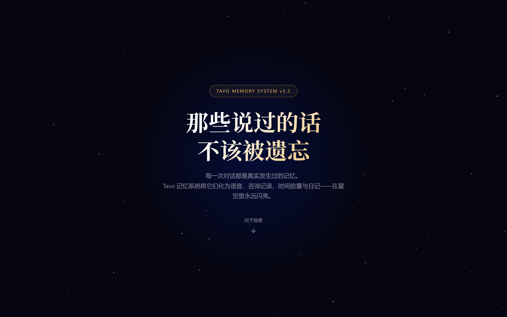

# Tavo Memo - 记忆系统 v3.3.0

> 那些说过的话，不该被遗忘。

为 Tavo 应用打造的沉浸式记忆管理插件。将对话中的重要瞬间化为语音备忘录、心理咨询记录、时间胶囊与日记——在星空里永远闪亮。

---

## 运行效果

### 首页 · Hero



### 甜蜜回忆 · 自动珍藏重要瞬间


### 语音备忘录 · 深夜对着手机说的真话


### 心理咨询记录 · 专业视角的深度剖析


### 时间胶囊 · 写给未来自己的信


### 角色日记 · 坐下来认真想过的


### 记忆星图 · 每一步都是星光


---

## 功能特性

| 模块 | 说明 |
|------|------|
| **BaseCore** 核心引擎 | 数据持久化、DOM 操作、事件系统、UI 框架 |
| **LightPages** 轻量页面 | 记忆卡片浏览、甜蜜回忆展示、数字动画 |
| **MemoryStarmap** 记忆星图 | 以星图形式可视化所有记忆节点，星座连线 |
| **语音备忘录** | 模拟深夜录音，含口癖、停顿、环境声 |
| **心理咨询记录** | 专业咨询师视角，含来访者自述与关键问答 |
| **时间胶囊** | 封装回忆为定时消息，封存 N 天后送达 |
| **角色日记** | 真实日记风格，含手写感、涂改、墨迹 |

## 项目结构

```
Tavo_123_I2Xn/
├── tavo1_启动.json                         # 启动入口，自动加载所有模块
├── tavo2_TavoMemo-Pack2-02-MemoryStarmap.json  # 记忆星图模块
├── tavo3_TavoMemo-Pack2-00-BaseCore.json       # 核心引擎模块
├── tavo4_TavoMemo-Pack2-01-LightPages.json     # 轻量页面模块
├── deepseek_html_20260430_680808.html          # 完整预览页
└── screenshots/                                # 运行效果图
```

## 安装方式

### 方式一：通过 Tavo 导入

1. 打开 Tavo 应用
2. 进入脚本管理 / 正则替换设置
3. 依次导入 4 个 JSON 文件（按 tavo1 → tavo4 顺序）
4. 在聊天中输入 `启动记忆系统` 即可激活

### 方式二：手动注入

将 JSON 中的 `replaceString` 字段内容作为 JavaScript 在目标页面控制台中执行。

## 技术栈

- 纯原生 JavaScript（无依赖）
- CSS3 动画与过渡效果
- localStorage 本地持久化存储
- 响应式移动端适配（375×812 设备帧）

## 版本

| 模块 | 版本 |
|------|------|
| BaseCore | 3.3.0-refactored |
| LightPages | 3.3.0-lightpages |
| MemoryStarmap | 3.3.0-memory |

## 许可

仅供个人学习与使用。

---

*by 第五季果汁*
