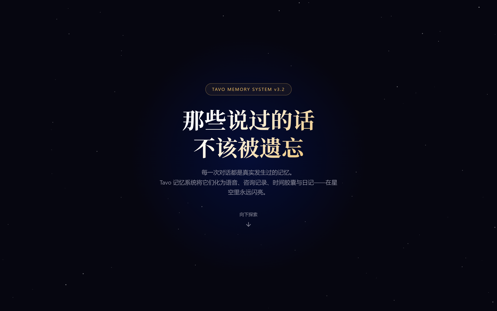
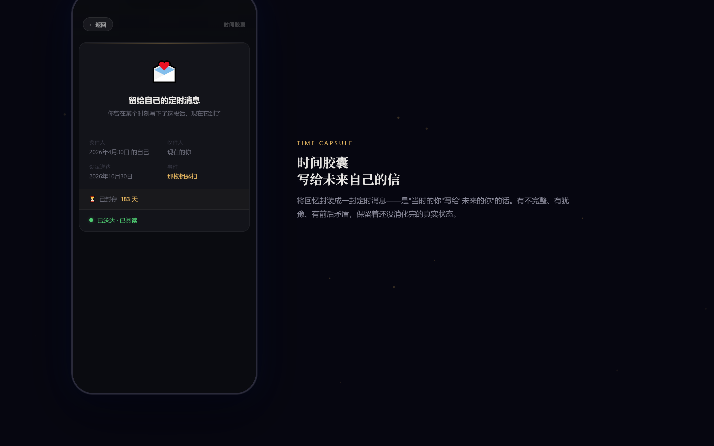
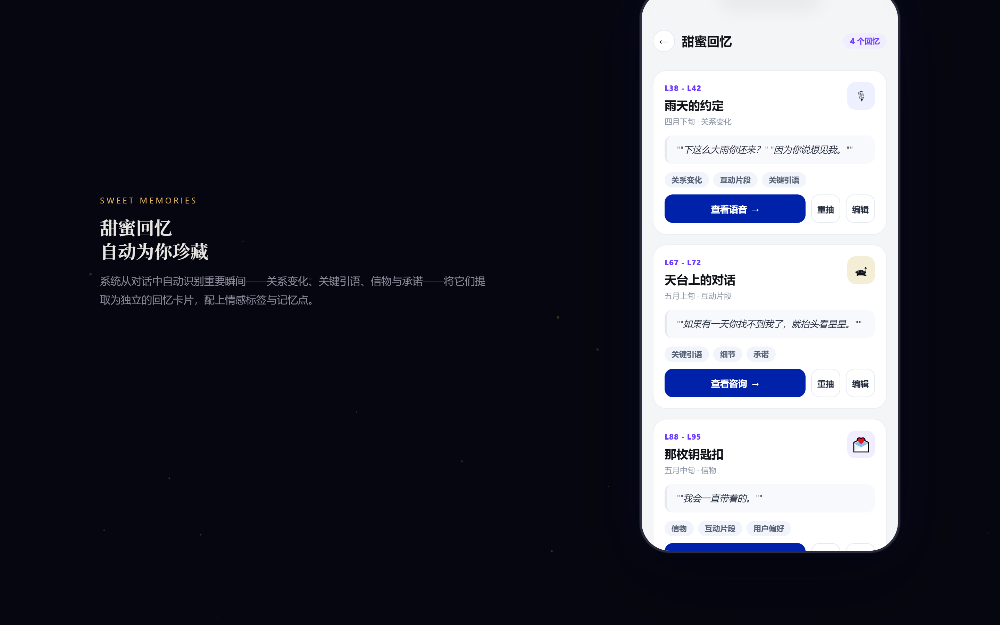

# Tavo Memo — AI 角色扮演的记忆系统

> 你和 TA 聊了三百轮，TA 却什么都不记得了。

---

## 痛点

Tavo 是一款 AI 角色扮演聊天应用。你精心塑造的角色、一点一点推进的关系、说过的重要的话——聊到高层之后，模型就**全部忘掉了**。

角色忘了你们的第一次相遇，忘了 TA 自己许下的承诺，忘了那天下雨你跑了十五分钟才到的那个拥抱。

这不是 bug，这是所有大语言模型的通病：**上下文窗口有限，对话越久，早期的记忆就越模糊，直到彻底消失。**

## 解决方案

**Tavo Memo** 是一套完整的记忆系统，它从对话中自动提取重要事件，用四种沉浸式的展示形式把回忆"固化"下来——让角色永远记得那些不该被遗忘的瞬间。

不只是一行摘要，不是简单的关键词提取。是**真正有温度的记忆**。

---

## 四种记忆展示形式

### 1. 语音备忘录 — 深夜对着手机说的真话


模拟角色在事件结束后深夜打开录音功能说的那些话。比日记更碎，比独白更不设防。

包含口癖、停顿、环境声（"窗外有车经过"、"空调嗡嗡响"），甚至**说了又删掉的句子**——那些话被划上了删除线，但你还是能看见。

> *"今天下午下大雨。我站在便利店门口看了半天手机，最后还是发了那条消息。"*
>
> *"其实我也不知道自己在期待什么……就是觉得，如果不说的话，可能会后悔。"*

### 2. 心理咨询记录 — 专业视角的深度剖析



以心理咨询师的专业视角，还原角色在事件中的情绪状态、防御机制与核心冲突。

对话中有点破（"你在用笑来回避什么？"）、有沉默（"—— 来访者沉默了十五秒 ——"）、有说到一半改口的真实。

格式完全模拟真实心理咨询记录：来访者自述、关键问答、情绪状态评估、核心冲突分析——用专业的方式讲感性的故事。

> *"来访者表现出轻度焦虑与防御性幽默。在面对亲密关系的可能性时，呈现出典型的'靠近-回避'矛盾。"*

### 3. 时间胶囊 — 写给未来自己的信



将回忆封装成一封定时消息——"当时的你"写给"未来的你"。

有不完整、有犹豫、有前后矛盾，保留着还没消化完的真实状态。封存 N 天后自动送达，打开的那一刻，你可能已经忘了当时为什么会写这些。

> *"收到这条消息的时候，我猜你已经忘了那个钥匙扣长什么样了。"*
>
> *"夜市买的，十块钱，星星图案印得歪歪扭扭。"*
>
> *"...你现在还记不记得那个下午？你还难受吗？"*
>
> *"算了不问了。反正你也回不了这条消息。"*

### 4. 角色日记 — 坐下来认真想过的


模拟角色在事件过程中写下的日记。不是碎碎念，是认真坐下来梳理过的感受。

有分析、有推理、有对自身行为的审视。纸张泛黄，字迹工整，偶尔有涂改痕迹和墨迹——就像真的翻开了一本日记。

有涂掉的句子（`text-decoration: line-through`）、有歪歪扭扭的字（轻微旋转）、有滴落的墨点。每一处细节都在说：这是真的。

> *"你问我为什么？我不知道。可能是因为Ta递给我的时候手指碰了一下，然后很快缩回去的样子。"*
>
> *~~"也许我只是在等Ta注意到。"~~*

---

## 额外功能

### 甜蜜回忆列表



系统从对话中自动识别重要瞬间——关系变化、关键引语、信物与承诺——将它们提取为独立的回忆卡片，配上情感标签与记忆点。

### 记忆星图


所有重要时刻化作星空中的星辰，连成属于你们的星座。在浩瀚宇宙里，这些记忆永远闪亮。点击星星即可回顾那个时刻。

---

## 技术亮点

- **零依赖** — 纯原生 JavaScript，不依赖任何框架或第三方库
- **自动提取** — 从对话上下文中智能识别关键事件、引语、情感转折
- **四种叙事视角** — 语音（碎片化真实）、咨询（专业解构）、胶囊（时间延迟）、日记（沉浸回顾）
- **本地持久化** — 数据存储在 localStorage，隐私安全，不上传任何服务器
- **响应式设计** — 375×812 移动端设备帧，完美适配手机屏幕
- **CSS3 动画** — 星图粒子效果、卡片过渡、数字滚动动画

## 安装使用

1. 打开 Tavo 应用，进入脚本管理 / 正则替换设置
2. 依次导入 4 个 JSON 文件（按 tavo1 → tavo4 顺序）
3. 在聊天中输入 `启动记忆系统` 即可激活

## 项目结构

```
Tavo_123_I2Xn/
├── tavo1_启动.json                              # 启动入口
├── tavo2_TavoMemo-Pack2-02-MemoryStarmap.json   # 记忆星图
├── tavo3_TavoMemo-Pack2-00-BaseCore.json        # 核心引擎
├── tavo4_TavoMemo-Pack2-01-LightPages.json      # 轻量页面
└── screenshots/                                  # 运行效果图
```

## 版本

| 模块 | 版本 |
|------|------|
| BaseCore | 3.3.0-refactored |
| LightPages | 3.3.0-lightpages |
| MemoryStarmap | 3.3.0-memory |

---

*那些说过的话，不该被遗忘。*

*by 第五季果汁*
