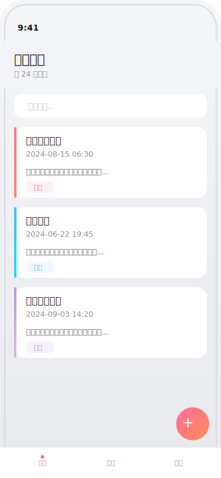
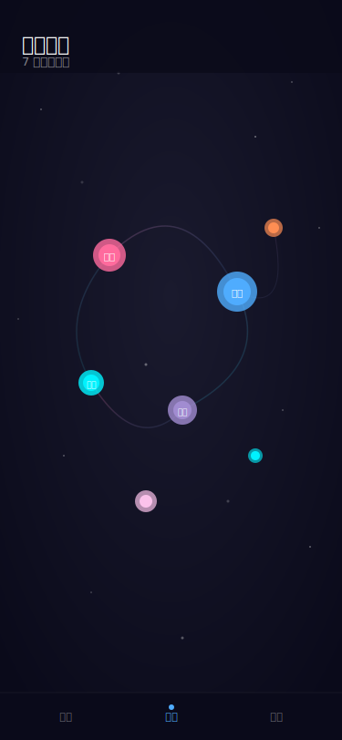
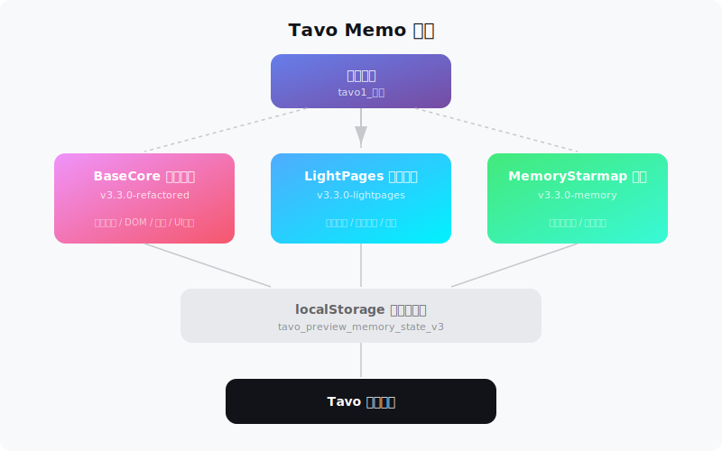

# Tavo Memo - 记忆系统 v3.3.0

> 为 Tavo 应用打造的沉浸式记忆管理插件，让每一段回忆都有迹可循。

Tavo Memo 是一个基于 JavaScript 的浏览器端记忆系统，通过 Tavo 的脚本注入机制运行，提供记忆创建、浏览、星图可视化等完整功能。

---

## 运行效果

| 记忆卡片 | 记忆星图 |
|:---:|:---:|
|  |  |

## 系统架构



---

## 功能特性

- **BaseCore 核心引擎** - 数据持久化、DOM 操作、事件系统、UI 框架
- **LightPages 轻量页面** - 记忆卡片浏览、甜蜜回忆展示、数字动画
- **MemoryStarmap 记忆星图** - 以星图形式可视化所有记忆节点
- **一键启动** - 自动加载所有模块，开箱即用

## 项目结构

```
Tavo_123_I2Xn/
├── tavo1_启动.json                         # 启动入口，自动加载所有模块
├── tavo2_TavoMemo-Pack2-02-MemoryStarmap.json  # 记忆星图模块
├── tavo3_TavoMemo-Pack2-00-BaseCore.json       # 核心引擎模块
├── tavo4_TavoMemo-Pack2-01-LightPages.json     # 轻量页面模块
└── screenshots/                                # 运行效果图
```

## 安装方式

### 方式一：通过 Tavo 导入

1. 打开 Tavo 应用
2. 进入脚本管理 / 正则替换设置
3. 依次导入 4 个 JSON 文件（按 tavo1 → tavo4 顺序）
4. 在聊天中输入 `启动记忆系统` 即可激活

### 方式二：手动注入

将 JSON 中的 `replaceString` 字段内容作为 JavaScript 在目标页面控制台中执行。

## 使用方法

启动后，系统会自动在页面中注入记忆管理界面：

- 点击浮动按钮打开记忆面板
- 浏览、创建、编辑记忆卡片
- 切换到星图视图查看记忆分布

## 技术栈

- 纯原生 JavaScript（无依赖）
- CSS3 动画与过渡效果
- localStorage 本地持久化存储
- 响应式移动端适配

## 版本

| 模块 | 版本 |
|------|------|
| BaseCore | 3.3.0-refactored |
| LightPages | 3.3.0-lightpages |
| MemoryStarmap | 3.3.0-memory |

## 许可

仅供个人学习与使用。
